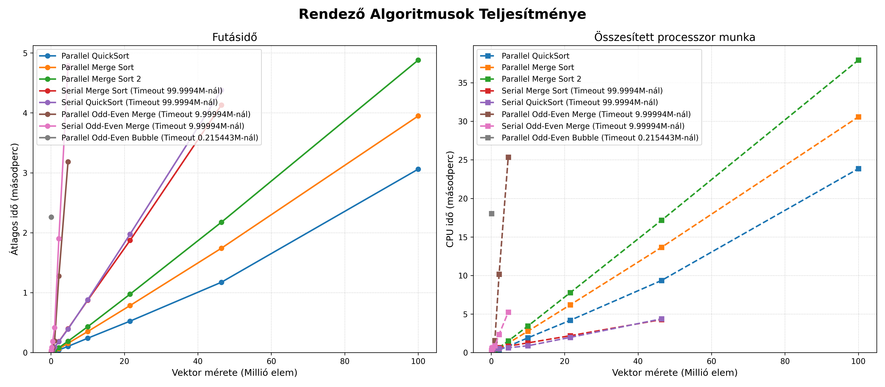
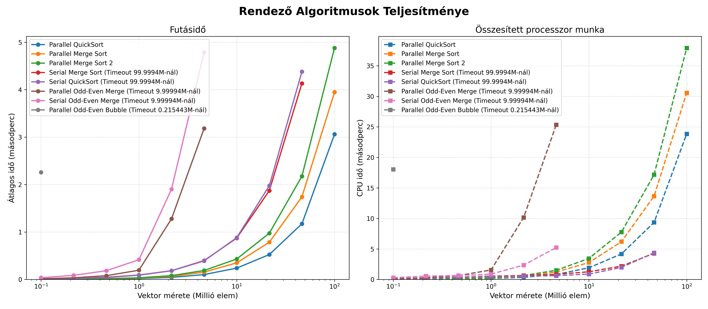
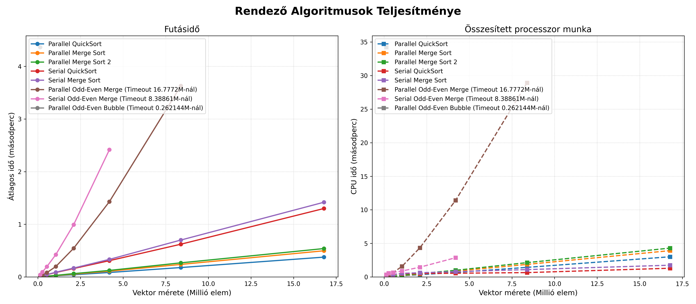
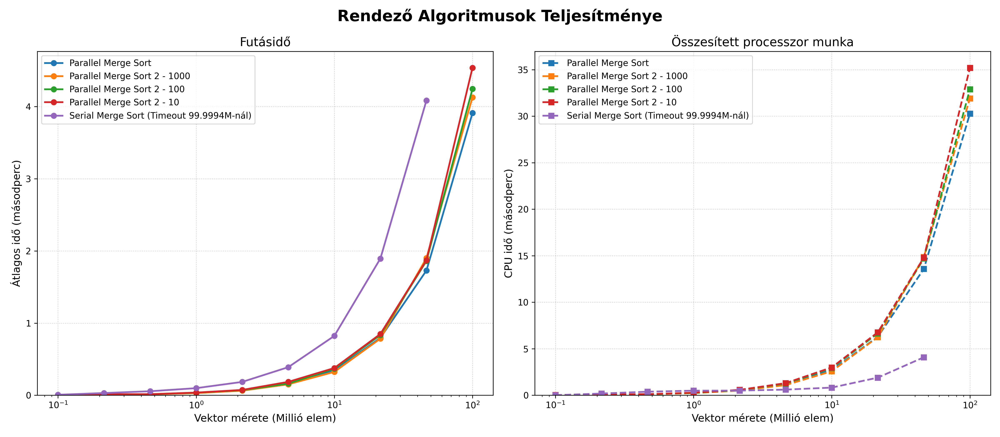
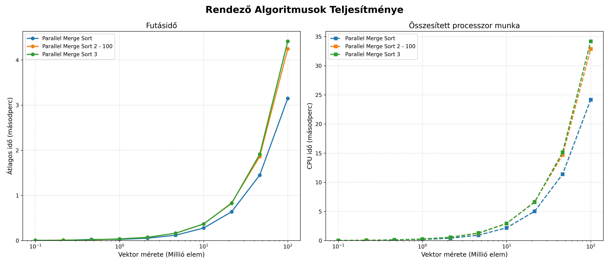

## Feladat leírása

Egy $n$ elemű tömb elemeinek növekvő sorrendbe történő rendezése $k$ párhuzamos szál (vagy egy szál) használatával. A feladat során különböző rendezési stratégiákat – klasszikus iteratív, oszd-meg-és-uralkodj, valamint rendező hálózat alapú algoritmusokat – implementálunk és párhuzamosítunk.

## Algoritmusok

### 1. Páros-Páratlan Buborékrendezés (Odd-Even Transposition Sort)

- **Komplexitás:** 
	- Idő: $O(n^2)$,
	- Hely: $O(1)$ (In-place). 
	- Párhuzamos idő: $O(n\frac{n}{k})$ - n-szer minden szomszédos elemet összehasonlítunk és megcserélünk, egyszer a 0. egyszer pedig az 1. elemtől kezdve
    
- **Leírás:** A klasszikus buborékrendezés párhuzamosításra optimalizált változata. Két váltakozó fázisból áll: a páratlan fázisban a `(1, 2), (3, 4)...` indexű párokat, a páros fázisban a `(2, 3), (4, 5)...` indexű szomszédos elemeket hasonlítjuk össze és cseréljük fel szükség esetén.
    
- **Soros (`SerialOddEvenBubbleSort`)**
    
    - _Leírás:_ Egyszálas iteratív megközelítés, amely ciklusok segítségével hajtja végre a páros és páratlan fázisokat.
        
- **Párhuzamos (`ParallelOddEvenBubbleSort`)**
    
    - _Leírás:_ Az egyes fázisokon belül az összehasonlítások teljesen függetlenek egymástól, így ezeket OpenMP `#pragma omp for` direktívával szétosztjuk a szálak között.
        
    - _Tervezői döntések:_ Mivel az algoritmus in-place működik, nincs memóriafoglalási overhead. Bár tökéletesen párhuzamosítható a belső ciklus, a nagyságrendi összes elvégzett munka $O(\frac{n^2}{k})$ marad, ami miatt skálázhatósága nagy adathalmazokon alacsony.
    - *Tapasztalatok*: Elég lassú és rosszul skálázódik, mivel a processzorok száma konstans ezért nagy inputok esetén elhanyagolható lesz a változás
        

### 2. Gyorsrendezés (Quick Sort)

- **Komplexitás:** 
	- Idő: $O(n \log n)$ (átlagos), $O(n^2)$ (legrosszabb). Hely: $O(\log n)$ (a rekurziós verem miatt).
	- Párhuzamos idő: $O(n\frac{\log n}{k} + n)$
	- 
    
- **Leírás:** Oszd-meg-és-uralkodj (Divide and Conquer) alapú algoritmus. Kiválaszt egy pivot elemet, a nála kisebbeket balra, a nagyobbakat jobbra rendezi (particionálás), majd a két létrejött részre rekurzívan meghívja önmagát.
    
- **Soros (`SerialQuickSort`)**
    
    - _Leírás:_ A klasszikus egyszálas rekurzív implementáció.
        
- **Párhuzamos (`ParallelQuickSort`)**
    
    - _Leírás:_ Feladatalapú (Task-based) párhuzamosítás. A particionálás (ami soros) után a bal és jobb oldali rekurzív hívásokat `#pragma omp task` segítségével önálló feladatokként osztja ki a szálkészletnek.
        
    - _Tervezői döntések:_
        
        - **Szál-bomba (Thread bomb) elkerülése:** Bevezetésre került egy `PARALLEL_THRESHOLD` (pl. 100 000 elem). Amikor a vizsgált részvektor mérete ez alá csökken, az algoritmus megszakítja a taszkok létrehozását, és egy rekurzív lambda függvény segítségével helyben, sorosan fejezi be a rendezést. Ez megakadályozza az operációs rendszer túlterhelését az adminisztrációs költségekkel (overhead).
        - A **particionálás soros megvalósítása**: A particionálást nehezen lehet párhuzamosan megvalósítani mivel építkezik a saját előző lépéseinek az eredményére, ezért annak párhuzamosítását elvetettem, ennek következtében viszont **a legnagyobb n-es komplexitású tagot nem sikerült csökkentetni**
            

### 3. Összefésülő rendezés (Merge Sort)

- **Komplexitás:** 
	- Idő: $O(n \log n)$ 
	- Hely: $O(n)$.
	- Párhuzamos idő: $O\left(\frac{n \log n}{k} + n\right)$
    
- **Leírás:** Oszd-meg-és-uralkodj algoritmus. A tömböt rekurzívan megfelezi egészen az 1 elemű részekig, majd a rendezett feleket lineáris időben összefésüli (merge).
    
- **Soros (`SerialMergeSort`)**
    
    - _Leírás:_ Egyszálas rekurzív megközelítés.
        
- **Párhuzamos (`ParallelMergeSort`)**
    
    - _Leírás:_ Hasonlóan a Quick Sorthoz, a két ágra történő rekurzív szétvágást `#pragma omp task` segítségével végzi. Egy `#pragma omp taskwait` biztosítja, hogy az összefésülés csak a gyermek-taszkok lefutása után kezdődjön meg.
        
    - _Tervezői döntések:_
        
        - **$O(1)$ dinamikus memóriafoglalás a futás alatt:** Az összefésüléshez szükséges átmeneti tömb (`temp`) csupán egyszer, a rendezés legelső lépése előtt kerül lefoglalásra, majd referenciaként passzolódik a rekurzióban. Ez drasztikusan csökkenti a memóriakezelési időt.
            
        - **Adatbiztonság (Data Race elkerülése):** A közös `temp` tömb használata a párhuzamos taszkok között teljesen biztonságos, mert a fa adott szintjén a szálak szigorúan diszjunkt (egymást nem átfedő) memóriatartományokba írnak és olvasnak.
            
        - **Soros szűk keresztmetszet:** Az összefésülést (`merge`) a szinkronizáció után már csak egy szál végzi. Ez Amdahl törvénye értelmében a párhuzamos gyorsítás elméleti korlátját jelenti nagy adathalmazoknál.
            

### 4. Odd-Even Merge Sort (Batcher-féle rendező hálózat)

- **Komplexitás:** 
	- Párhuzamos idő: $O(n\log^2 n)$
	- Hely: $O(n)$.
    
- **Leírás:** Kifejezetten párhuzamos feldolgozásra optimalizált rendező hálózat (Sorting Network). A tömböt megfelezi, majd a rendezett feleket páros és páratlan indexű elemekre bontva fésüli össze. Végül egy szomszédos összehasonlító-cserélő (compare-exchange) lépéssel teszi teljesen rendezetté a sorozatot.
    
- **Soros (`SerialOddEvenMergeSort`)**
    
    - _Leírás:_ A hálózat felépítésének szimulációja egyetlen szálon, rekurzív függvényhívásokkal.
        
- **Párhuzamos (`ParallelOddEvenMergeSort`)**
    
    - _Leírás:_ Feladatalapú párhuzamosítással hajtja végre a független hálózati ágak kiértékelését (a páros és páratlan al-összefésüléseket).
        
    - _Tervezői döntések:_
        
        - **Kettő hatványára való kiegészítés (Padding):** Az algoritmus matematikailag csak $2^m$ méretű bemeneteken működik tökéletesen. Ha a bemeneti tömb hossza nem kettő hatványa, az algoritmus automatikusan megnöveli a vektort a következő kettő hatványáig `INT_MAX` (végtelen) elemekkel kitöltve, majd a rendezés legvégén ezeket a stróman-elemeket levágja (`resize`).
            
        - **Küszöbérték alkalmazása:** Hasonlóan a többi fa-struktúrájú algoritmushoz, a megfelelő szint elérése után soros fall-back mechanizmust használ az overhead minimalizálása érdekében.

## Mérések és következtetések

- A mérésen jól látszik, hogy a odd-even merge mindig kiegészíti a vektor méretét 2 hatványra, ezért ha a bemenetek 2 hatványok akkor jobban teljesítenek
	- Az általam vártnál jelentősen rosszabbul teljesítettek, feltételezhetően mivel log négyzetes a komplexitásuk
	- A forrásból amiből dolgoztam végtelen szállal számolva elérhető a $\log^2n$ 
- A legjobban a parallel merge sort és quick sort teljesítettek, feltételezhetően azért mert a komplexitásuk soros módon is optimális és kevés (8) szállal viszonylag hatékonyan lehetett őket párhuzamosítani - **Kérdésként következik, hogy több szál esetén romlik-e a gyorsítás a soros algoritmushoz képest**

- A merge sorthoz két féle implementációt írtam, a különbség a 2 között, hogy a 2-esben a merge részét is párhuzamosítottam az algoritmusnak. A merge-hez a küszöbérték 10 szeresét használtam. (A merge sort 2 mellett a küszöbérték skálázási faktorja látható)
	- A első implemetáció kicsit jobban teljesített. Az overhead túl nagy lehet és a legtöbb esetben, már dolgozik az összes szál így igazából csak azoknak az ütemezését zavarja meg. Érdekes lehet megnézni, hogy csak az utolsó merge van párhuzamosítva, ahol már minden szál végzett a feladatával.
	