

# Párhuzamos algoritmusok implementációjának vizsgálata
### Minimális feszítőfák, rendezések és adattömörítés modern többmagos architektúrákon

**Készítette:** Gödölle Dénes 
**Dátum:** 2026.

 
 

# Bevezetés és mérési környezet

## Bevezetés

Az önálló laboratóriumom témájának címe a párhuzamos algoritmusok implementálásának vizsgálata. Azzal a témával foglalkozom, hogy soros algoritmusokat hogyan lehet párhuzamosítani, és a matematikai párhuzamos algoritmusokat hogyan lehet hatékonyan implementálni. A matematikai algoritmusok sok esetben nincsenek tekintettel a technikai korlátokra, például a maximum lehetséges szálak számára vagy a szálak létrehozásának többletköltségére. Ennek az önálló laboratóriumnak a célja, hogy ezeket az aspektusokat vizsgálja. Három algoritmuscsaládot vizsgálok: a minimumkeresést listában, a rendezést listában, és a minimális feszítőfa keresést gráfokon.
## Fejlesztői és mérési környezet

Az algoritmusokat C++-ban implementáltam, és kerestem hozzájuk meglévő implementációkat. A minimumkeresésnél összehasonlítottam a C++ thread könyvtárát egy threadpool osztály használatával és az OpenMP könyvtár használatával. A további teszteléshez a konzisztencia és a hatékonyság miatt kizárólag az OpenMP-t használtam.
### A mérési laptop specifikációja
#### Hardware Information:
- **Hardware Model:** ASUSTeK COMPUTER INC. ZenBook UX431FL_UX431FL
- **Memory:** 8.0 GiB
- **Processor:** Intel® Core™ i5-8265U × 8
- **Graphics:** Intel® UHD Graphics 620 (WHL GT2)
- **Graphics 1:** NVIDIA GeForce MX250
- **Disk Capacity:** 768.2 GB
#### Software Information:
- **Firmware Version:** UX431FL.304
- **OS Name:** Ubuntu 24.04.4 LTS
- **OS Build:** (null)
- **OS Type:** 64-bit
- **GNOME Version:** 46
- **Windowing System:** X11
- **Kernel Version:** Linux 6.17.0-23-generic
#### Mérési környezet
Ubuntu operációs rendszeren végeztem a mérést. Az energiamódot a legjobb teljesítményre állítva teszteltem. A tesztek futása alatt nem volt megnyitva semmilyen alkalmazás a VSCode-on kívül, amiben a tesztelést végeztem.

# Minimum kereső algoritmusok
## Feladat leírása
Klasszikus keresés egy tömbben. Egy $n$ elemű tömb legkisebb elemének megkeresése $k$ párhuzamos szál használatával.
## Algoritmusok
### 1. Soros (Serial)
- **Algoritmus név:** `SerialMin`

- **Időkomplexitás:** $O(n)$

- **Helykomplexitás:** $O(n)$

- **Leírás:** A klasszikus, egyetlen szálon futó lineáris keresés. Egy `min_val` változóban tartja az eddig talált legkisebb értéket, és végigiterál a tömb összes elemén. Konstans referenciaként veszi át a tömböt.

- **Tervezői döntések:**
    - **Bázis (Baseline) a mérésekhez:** Ez az algoritmus szolgál viszonyítási alapként. Ennek az idejéhez mérjük a párhuzamos algoritmusok gyorsulását (Speedup).
    - **Fallback stratégia:** A komplexebb párhuzamos algoritmusok (pl. rekurzív tömörítés) a fa legalsó szintjein (amikor a méret egy küszöbérték, pl. 5000-10000 alá csökken) visszaváltanak erre a soros végrehajtásra, mivel ott már a szálkezelés adminisztrációs költsége (overhead) meghaladná a párhuzamosítás hasznát.
### 2. Szeletelés (Reduction / Chunking)
- **Leírás:** A tömböt `k` részre (chunk) vágjuk. Minden szál függetlenül, sorosan megkeresi a saját darabjának a minimumát. A legvégén a kapott `k` darab részeredményt egy végső minimumkereséssel egyesítjük.

- **OMP Reduction (`OmpReduction`)**
    - **Leírás**: Az OpenMP beépített `#pragma omp parallel for reduction(min:min_val)` direktíváját használja, amely a háttérben elvégzi a szeletelést és az összevonást.
    - **Tervezői döntések**: Mivel a ciklusmag csak egy egyszerű összehasonlítás, a statikus ütemezés (alapértelmezett) a legcélravezetőbb. A szálak előre megkapják a saját fix szeletüket, így a futás közbeni szinkronizáció (contention) minimális.
        
- **OMP SIMD (`OmpSimd`)**
    - _Leírás:_ A CPU vektoros utasításkészletét (pl. AVX, SSE) használja. A `#pragma omp simd` hatására a processzor regisztereibe egyszerre több elem töltődik be, és egyetlen órajelciklus alatt több összehasonlítás (Single Instruction, Multiple Data) történik.
    - _Tervezői döntések:_ Kifejezetten hardverközeli optimalizáció. Kihasználja a modern processzorok architektúráját a memóriafüggetlen (data-parallel) műveleteknél. Kombinálható lenne a szál-szintű párhuzamosítással is.
        
- **STD Parallel C++17 (`StdParallel`)**
    - _Leírás:_ A C++17 szabvány beépített párhuzamos algoritmusa: `std::min_element(execution::par, ...)`. Referenciaként lehet használni a többi implementációhoz.
        
- **ThreadPool Reduction (`ThreadPoolReduction`)**
    - _Leírás:_ A szeletelési elv manuális implementációja egyedi szálkészlet (Thread Pool) segítségével. A vektor `num_workers` részre van vágva, a részeredmények egy `partial_mins` tömbbe kerülnek.
    - _Tervezői döntések:_ A főszál és a worker szálak közötti szinkronizációhoz aktív várakozás (spin-lock) helyett `std::condition_variable` és `std::mutex` használata. Ez garantálja, hogy a főszál nem emészti fel a CPU időt, amíg a többi szál dolgozik (a CPU-Work mérés pontossága miatt kritikus).
        
### Mérések és következtetések
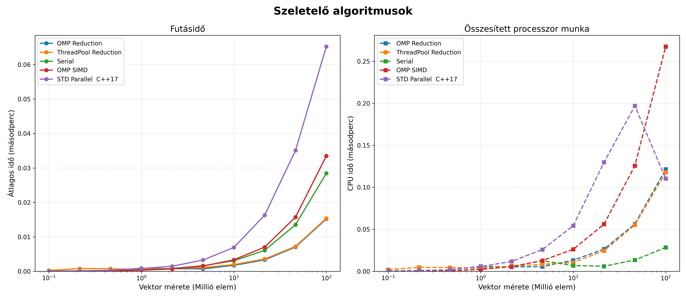

- A ThreadPool és az OpenMP hasonlóan működnek, mert az OpenMP is a háttérben egy poolt használ, ezért az azonos alapon működő implementációjuk is nagyon hasonló futásidővel rendelkezik.
- Az `std::parallel` min függvény valamennyivel rosszabb hatásfokkal működött a mérési körülmények között. A belső implementációja a fordítótól és verziótól függően akár eltérő is lehet.
- Az OpenMP SIMD függvényben a vektorizációt nagy eséllyel vagy nem sikerült elindítania az OpenMP-nek, vagy a vektorok mérete lett túl kicsi ahhoz, hogy optimális legyen a gyorsítás. Bár ez nem valószínű, hogy fennáll a 100 milliós vektorhossznál is, mivel a vektor csak 8 részre lett osztva. További lehetőség, hogy valamiért nem sikerült a fordítónak a vektorizációt és a párhuzamos futást összehangolnia.
- Bár az összesített processzormunka több a szeletelő algoritmusoknál, mint a soros algoritmusnál, ennek ellenére is hatékonyabbak tudnak lenni. A mérések alapján megközelítőleg 2-szeres gyorsítást sikerült elérni. A komplexitás alapján lineárisan arányos a soros algoritmus lépésszámával, a párhuzamosítás overheadje a szálak számával áll korrelációban és független a vektor méretétől, így annak növelésével egyre nagyobb lesz a futási idő különbsége a soros algoritmushoz képest.
- Érdekes, hogy a sok többlet CPU idő mitől keletkezhetett, mivel maga az algoritmus elméletben alig igényelne több CPU időt még ha sorban, egymás után futnának is a szálak. Feltehetőleg a futási környezet, paraméterek és információk betöltése veszi el a legtöbb időt, és ezekhez képest a keresés ideje elhanyagolható.

### 3. Tömörítés (Compression / Tree Reduction)

- **Komplexitás:**
    - Rekurziószám: $\log_{2}(n)$
    - Mértani sorozat: $n/2 + n/4 + \dots + 1 \approx n - 1$. Összes elvégzett munka: $O(n)$
    - Összesen: $O\left(\frac{n}{k} + \log n\right)$
        
- **Leírás:** Páronként összehasonlítjuk az elemeket, és csak a kisebbet tartjuk meg. Ezt a megfelezést iteratívan vagy rekurzívan addig folytatjuk, amíg egyetlen elem marad.
    
- **Puffercsere Tömörítés (`OmpCompression`)**
    - _Leírás:_ Két vektort (`pufferA` és `pufferB`) használ, amelyek a rekurziós lépések során szerepet cserélnek: az egyikből csak olvasnak a szálak, a másikba csak írnak.
    - _Tervezői döntések:_ Memóriafoglalás minimalizálása. Csak a legelső lépésben történik Heap allokáció. A ciklusok közbeni folytonos `std::vector` létrehozás drasztikusan lelassítaná a programot. Szálbiztonság (Data Race prevenció): A szerepcsere elv garantálja, hogy a szálak szigorúan különálló memóriaterületekről olvasnak és írnak, elkerülve a Read-Write Hazardokat.
        
- **Lépésköz-hosszabbító In-place Tömörítés (`StridedCompression`)**
    - _Leírás:_ Egyetlen tömböt (in-place) használ, a külső ciklus a lépésközt (stride) duplázza (1, 2, 4, 8...). A belső OpenMP ciklus a `values[i]` és `values[i + stride]` értékeket hasonlítja össze.
    - _Tervezői döntések:_ Kiegészítő memóriaigénye tökéletes ($O(1)$) - (kimeneti memóriaigény: $O(N)$). Hardveres anomáliák bemutatása: Bár az elméleti aszimptotikus komplexitása kiváló, a gyakorlatban a kis lépésközöknél a **False Sharing** (hamis megosztás az L1 cache vonalakon), nagy lépésközöknél pedig a **Cache Misses** (memóriaugrálások) drasztikusan lerontják a hatékonyságát.
        
- **Rekurzív Async (`AsyncCompression`)**
    - _Leírás:_ Oszd-meg-és-uralkodj (Divide and Conquer) elv. A tömböt virtuálisan megfelezi, az egyik felét egy `std::async` aszinkron feladatként elindítja, a másik felét maga folytatja, majd összehasonlítja a két részeredményt.
    - _Tervezői döntések:_ A **Küszöbérték (Threshold)** jelenléte kritikus. Ha az algoritmus az 1-es tömbméretig menne le aszinkron hívásokkal, a több százezer operációs rendszer szintű szál létrehozása azonnal _Thread Bomb_-ot (erőforrás-kimerülést / Out of Memory-t) okozna.
        
- **ThreadPool Pairwise (`ThreadPoolPairwise`)**
    - _Leírás:_ Egy `std::deque`-ből kivett elempárokat csomagol be `std::promise`-okba és küldi be a feladatsorba (enqueue), hogy a ThreadPool feldolgozza őket.
    - _Tervezői döntések (Anti-pattern esettanulmány):_ Annak bemutatására szolgál, hogy a túl finomszemcsézettségű (fine-grained) párhuzamosítás hogyan teszi tönkre a futást. Millió elemszámnál a memóriában létrejövő rengeteg `std::future` objektum és a Task Queue lezárásainak adminisztrációs költsége nagyságrendekkel tovább tart, mint maga a matematikai művelet, és hatalmas méreteknél OS-szintű omlást okoz.
        

**Tanulságok:**

- Minél kevesebb vektort használjunk, kerüljük, hogy minden rekurziós szinten létre kelljen hozni egy újat.
    - Használjunk két vektort, amit cserélgetünk, hogy melyik tárolja a jó eredményeket és melyik a bemeneti adatokat.
    - Használjunk egy vektort, és minden rekurzióban növeljük a lépéshosszát a bejárásának – lehetséges probléma az adatok írása miatt a cache-ben lévő blokkok kiesése a memóriablokk-írások frissítése miatt.
- Legyen egy határ (threshold), ami alatt sorosan oldjuk meg a feladatot.
### Mérések, következtetések
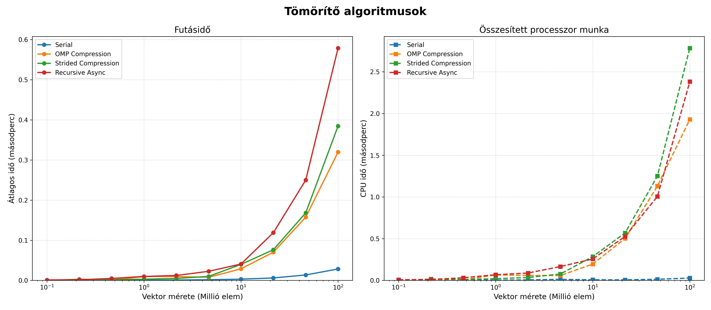
- Jelentősen rosszabb hatékonyságúak, mint a szeletelő algoritmusok.
- Egyik implementációnak sem sikerült elérnie a soros algoritmus hatékonyságát.
- A lépéshossznövelő megközelítés kicsit rosszabbul teljesített a szerepcserés puffermegközelítéshez képest (várhatóan a cache miatt).
- A rekurzív aszinkron nagyon sok taskot hoz létre, és nem veszi figyelembe a rendelkezésre álló szálak számát, ezzel nagy overheadet generál a fölösleges kontextusváltások által.
- A páronkénti hasonlítást nem jelenítettem meg a grafikonon, mivel minden algoritmusnál jelentősen rosszabbul teljesített. Ahogy várható volt, a túl kicsi feladatok párhuzamosítása (fine-grained) csak növeli a párhuzamosítási költséget (overheadet).

## Konklúzió
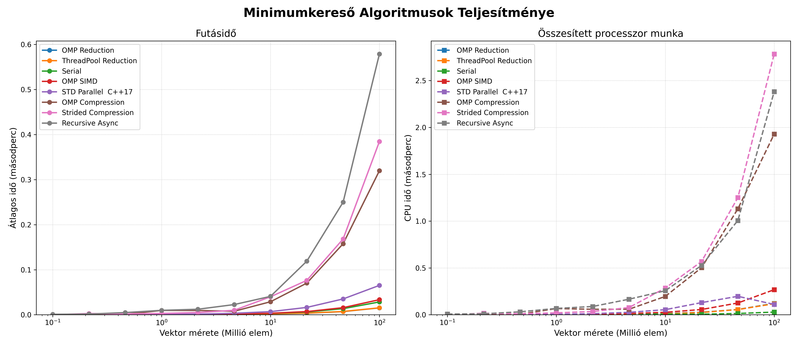
- Az ábrán jól különválasztható a két algoritmikus megközelítés, de az implementáció is befolyásolja a hatékonyságot (bár kisebb mértékben).
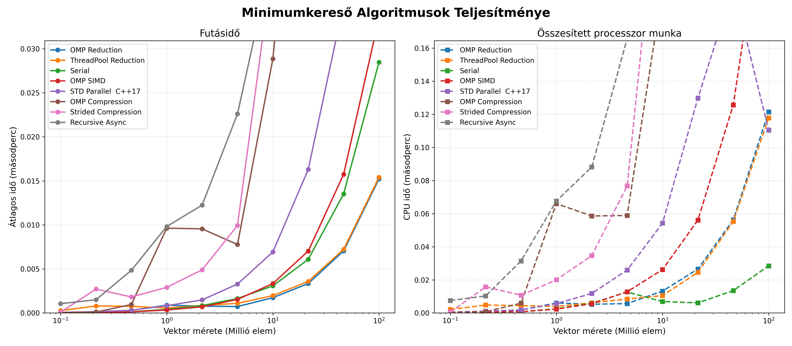
- Jelentős gyorsítást nem vehetünk észre. Kb. 2-szeres gyorsulás mutatkozik 100 millió elemű tömb esetén, ami a grafikont figyelve nagyjából konstans 10 millió fölött, de lehetséges, hogy nagyobb méretek esetében még valamennyivel jobb relatív hatékonyságot el lehet érni.
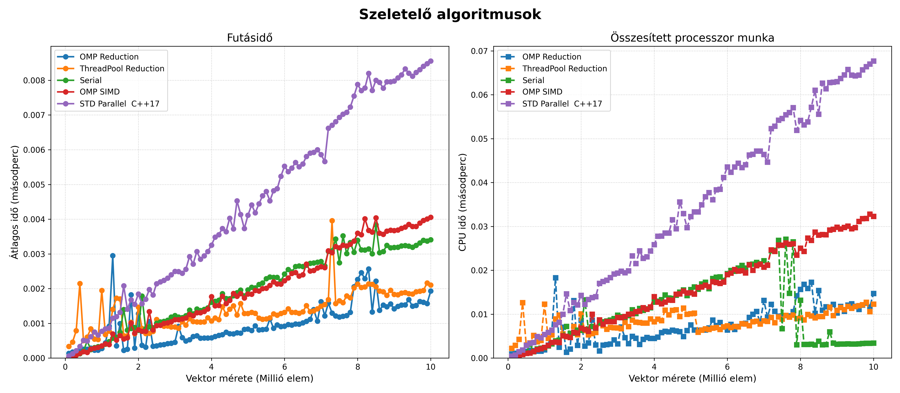
- Nagyjából 200 és 400 ezer között veszik át gyorsaságban a vezetést a szeletelő algoritmusok.
- Érdekes még megfigyelni, hogy elég nagy kiugrások vannak a grafikonon még úgy is, hogy minden méretre 5-ször futtattam az adott algoritmust, és ennek az átlagát vettem fel a grafikonra.
- A soros minimum keresésnél meglepő eredmény volt, hogy  8 millió hosszú tömb felett az összesített processzor munkában volt egy visszaesés. Erre nem találtam biztos magyarázatot. 

# Rendező algoritmusok

## Feladat leírása

Egy $n$ elemű tömb elemeinek növekvő sorrendbe történő rendezése $k$ párhuzamos szál (vagy egy szál) használatával. A feladat során különböző rendezési stratégiákat – klasszikus iteratív, oszd-meg-és-uralkodj, valamint rendezőhálózat alapú algoritmusokat – implementálunk és párhuzamosítunk.

## Algoritmusok

### 1. Páros-Páratlan Buborékrendezés (Odd-Even Transposition Sort)

- **Komplexitás:**
    - Idő: $O(n^2)$
    - Hely: $O(1)$ (In-place)
    - Párhuzamos idő: $O(\frac{n^2}{k})$ - n-szer minden szomszédos elemet összehasonlítunk és megcserélünk, egyszer a 0., egyszer pedig az 1. elemtől kezdve.
        
- **Leírás:** A klasszikus buborékrendezés párhuzamosításra optimalizált változata. Két váltakozó fázisból áll: a páratlan fázisban az `(1, 2), (3, 4)...` indexű párokat, a páros fázisban a `(2, 3), (4, 5)...` indexű szomszédos elemeket hasonlítjuk össze és cseréljük fel szükség esetén.
    
- **Soros (`SerialOddEvenBubbleSort`)**
    - _Leírás:_ Egyszálas iteratív megközelítés, amely ciklusok segítségével hajtja végre a páros és páratlan fázisokat.
        
- **Párhuzamos (`ParallelOddEvenBubbleSort`)**
    - _Leírás:_ Az egyes fázisokon belül az összehasonlítások teljesen függetlenek egymástól, így ezeket OpenMP `#pragma omp for` direktívával szétosztjuk a szálak között.
    - _Tervezői döntések:_ Mivel az algoritmus in-place működik, nincs memóriafoglalási overhead. Bár tökéletesen párhuzamosítható a belső ciklus, a nagyságrendi összes elvégzett munka $O(n^2)$ marad, ami miatt skálázhatósága nagy adathalmazokon alacsony.
    - _Tapasztalatok:_ Elég lassú és rosszul skálázódik. Mivel a processzorok száma konstans, ezért nagy inputok esetén elhanyagolható lesz a változás.
        

### 2. Gyorsrendezés (Quick Sort)

- **Komplexitás:**
    - Idő: $O(n \log n)$ (átlagos), $O(n^2)$ (legrosszabb).
    - Hely: $O(\log n)$ (a rekurziós verem miatt).
    - Párhuzamos idő: $O(n\frac{\log n}{k} + n)$
        
- **Leírás:** Oszd-meg-és-uralkodj (Divide and Conquer) alapú algoritmus. Kiválaszt egy pivot elemet, a nála kisebbeket balra, a nagyobbakat jobbra rendezi (particionálás), majd a két létrejött részre rekurzívan meghívja önmagát.
    
- **Soros (`SerialQuickSort`)**
    - _Leírás:_ A klasszikus egyszálas rekurzív implementáció.
        
- **Párhuzamos (`ParallelQuickSort`)**
    - _Leírás:_ Feladatalapú (Task-based) párhuzamosítás. A particionálás (ami soros) után a bal és jobb oldali rekurzív hívásokat `#pragma omp task` segítségével önálló feladatokként osztja ki a szálkészletnek.
    - _Tervezői döntések:_
        - **Szálbomba (Thread bomb) elkerülése:** Bevezetésre került egy `PARALLEL_THRESHOLD` (pl. 100 000 elem). Amikor a vizsgált részvektor mérete ez alá csökken, az algoritmus megszakítja a taszkok létrehozását, és egy rekurzív lambda függvény segítségével helyben, sorosan fejezi be a rendezést. Ez megakadályozza az operációs rendszer túlterhelését az adminisztrációs költségekkel (overhead).
        - **A particionálás soros megvalósítása:** A particionálást nehezen lehet párhuzamosan megvalósítani, mivel építkezik a saját előző lépéseinek az eredményére. Ezért annak párhuzamosítását elvetettem, ennek következtében viszont **a legnagyobb n-es komplexitású tagot nem sikerült csökkenteni**.
            

### 3. Összefésülő rendezés (Merge Sort)

- **Komplexitás:**
    - Idő: $O(n \log n)$
    - Hely: $O(n)$
    - Párhuzamos idő: $O\left(\frac{n \log n}{k} + n\right)$
        
- **Leírás:** Oszd-meg-és-uralkodj algoritmus. A tömböt rekurzívan megfelezi egészen az 1 elemű részekig, majd a rendezett feleket lineáris időben összefésüli (merge).
    
- **Soros (`SerialMergeSort`)**
    - _Leírás:_ Egyszálas rekurzív megközelítés.
        
- **Párhuzamos (`ParallelMergeSort`)**
    - _Leírás:_ Hasonlóan a Quick Sorthoz, a két ágra történő rekurzív szétvágást `#pragma omp task` segítségével végzi. Egy `#pragma omp taskwait` biztosítja, hogy az összefésülés csak a gyermek-taszkok lefutása után kezdődjön meg.
    - _Tervezői döntések:_
        - **$O(1)$ dinamikus memóriafoglalás a futás alatt:** Az összefésüléshez szükséges átmeneti tömb (`temp`) csupán egyszer, a rendezés legelső lépése előtt kerül lefoglalásra, majd referenciaként adódik át a rekurzióban. Ez drasztikusan csökkenti a memóriakezelési időt.
        - **Adatbiztonság (Data Race elkerülése):** A közös `temp` tömb használata a párhuzamos taszkok között teljesen biztonságos, mert a fa adott szintjén a szálak szigorúan diszjunkt (egymást nem átfedő) memóriatartományokba írnak és olvasnak.
        - **Összefésülés:**
            - **Soros szűk keresztmetszet:** A Merge Sort algoritmusnál az összefésülést (`merge`) a szinkronizáció után már csak egy szál végzi. Ez Amdahl törvénye értelmében a párhuzamos gyorsítás elméleti korlátját jelenti nagy adathalmazoknál.
            - **Párhuzamos megvalósítás:** A párhuzamos összefésülést **Blokkokra bontással (Block Decomposition)** és **Bináris kereséssel** valósítottam meg. Így az OpenMP szálak egymástól teljesen független, diszjunkt memóriaterületeken tudtak dolgozni (elkerülve a Data Race-t), és a visszamásolás fázisát is párhuzamosítottam a maximális memória-sávszélesség kihasználásához.

### 4. Odd-Even Merge Sort (Batcher-féle rendezőhálózat) [5]

- **Komplexitás:**
    - Párhuzamos idő: $O(n\log^2 n)$
    - Hely: $O(n)$
        
- **Leírás:** Kifejezetten párhuzamos feldolgozásra optimalizált rendezőhálózat (Sorting Network). A tömböt megfelezi, majd a rendezett feleket páros és páratlan indexű elemekre bontva fésüli össze. Végül egy szomszédos összehasonlító-cserélő (compare-exchange) lépéssel teszi teljesen rendezetté a sorozatot.
    
- **Soros (`SerialOddEvenMergeSort`)**
    - _Leírás:_ A hálózat felépítésének szimulációja egyetlen szálon, rekurzív függvényhívásokkal.
        
- **Párhuzamos (`ParallelOddEvenMergeSort`)**
    - _Leírás:_ Feladatalapú párhuzamosítással hajtja végre a független hálózati ágak kiértékelését (a páros és páratlan al-összefésüléseket).
    - _Tervezői döntések:_
        - **Kettő hatványára való kiegészítés (Padding):** Az algoritmus matematikailag csak $2^m$ méretű bemeneteken működik tökéletesen. Ha a bemeneti tömb hossza nem kettő hatványa, az algoritmus automatikusan megnöveli a vektort a következő kettő hatványáig `INT_MAX` (végtelen) elemekkel kitöltve, majd a rendezés legvégén ezeket a stróman-elemeket levágja (`resize`).
        - **Küszöbérték alkalmazása:** Hasonlóan a többi fastruktúrájú algoritmushoz, a megfelelő szint elérése után soros fall-back mechanizmust használ az overhead minimalizálása érdekében.
    - _Lehetséges problémák:_
        - A modern CPU-k gyorsítótára (L1/L2 Cache) az egymás utáni memóriahozzáférést (szekvenciális olvasás) preferálja. Mivel az Odd-Even Merge algoritmus a ciklusokban hatalmas lépésközökkel "ugrál" a memóriában, folyamatos Cache Miss (gyorsítótár-tévesztés) lép fel. Emiatt a CPU folyamatosan a lassú RAM-ra vár. Ez az oka, hogy ez az algoritmus szoftveres CPU környezetben elvérzik, és inkább GPU-kra való.
## Mérések és következtetések

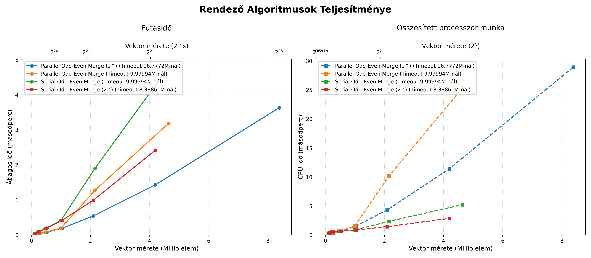
- A mérésen jól látszik, hogy az Odd-Even Merge mindig kiegészíti a vektor méretét 2 hatványára, ezért ha a bemenetek 2 hatványai, akkor jobban teljesít.
    - Az általam vártnál jelentősen rosszabbul teljesítettek, feltételezhetően mivel log-négyzetes a komplexitásuk.
    - A forrás, amiből dolgoztam, végtelen szállal számolva elérhetőnek tartja az $O(\log^2n)$ időt.
- A legjobban a Parallel Merge Sort és Quick Sort teljesítettek. Feltételezhetően azért, mert a komplexitásuk soros módon is optimális, és kevés (8) szállal viszonylag hatékonyan lehetett őket párhuzamosítani. **Kérdésként következik, hogy több szál esetén romlik-e a gyorsítás a soros algoritmushoz képest.**

A Merge Sorthoz kétféle implementációt írtam, a különbség a 2 között, hogy a 2-esben a merge részét is párhuzamosítottam az algoritmusnak. A merge-hez a küszöbérték 10-szeresét használtam. (A Merge Sort 2 mellett a küszöbérték skálázási faktora látható).
- Az első implementáció kicsit jobban teljesített. Az overhead túl nagy lehet, és a legtöbb esetben már dolgozik az összes szál, így igazából csak azoknak az ütemezését zavarja meg. Érdekes lehet megnézni, hogy ha csak az utolsó merge van párhuzamosítva, ahol már minden szál végzett a feladatával, mi történik.

# Minimális feszítőfa (MST) kereső algoritmusok

Ez a dokumentum a klasszikus minimális feszítőfa (Minimum Spanning Tree – MST) algoritmusokat foglalja össze, kitérve a szekvenciális (soros) futtatásra és a modern, többmagos processzorokra tervezett párhuzamos implementációkra. Az MST egy összefüggő, irányítatlan gráf éleinek olyan részhalmaza, amely minden csúcsot összeköt körök kialakulása nélkül, és ahol az élek összsúlya a lehető legkisebb [1].

## Feladat
A feladat egy $G(V, E)$ gráfban egy minimális összsúlyú feszítőfát keresni, és ennek a súlyát kiszámolni. A gráf összefüggő, és minden élsúly pozitív, 0-nál nagyobb egész szám.

## Jelölések
- **G:** Gráf
- **V:** Csúcsok (Vertices) száma
- **E:** Élek (Edges) száma

## Gráf Reprezentációk és Komplexitásuk
A gráf tárolásának módja kritikus hatással van az algoritmusok sebességére:
- **Szomszédsági mátrix:** Gyors elérést biztosít ($O(1)$), de nagy a memóriaigénye ($O(V^2)$).
- **Szomszédsági lista:** Sokkal helytakarékosabb ($O(E)$), viszont az élek keresése lassabb ($O(\log E)$ vagy átlagosan $O(E/V)$ egy adott csúcsból indulva).
## 0. Diszjunkt halmazok uniója (Disjoint Set Union - DSU - Unio-Holvan)

A Disjoint Set Union (DSU), más néven Union-Find, egy olyan adatszerkezet, amely egymástól diszjunkt (közös elem nélküli) halmazok nyilvántartására szolgál. Az MST algoritmusoknál (különösen a Kruskal és a Borůvka esetében) ez az adatszerkezet felel a fák (komponensek) egyesítéséért és a **rendkívül hatékony kördetektálásért**. Két alapvető művelete van: a `find` (megkeresi, melyik halmaz gyökeréhez tartozik egy elem) és az `unite` (két halmazt egyesít).
A magas teljesítmény eléréséhez a DSU két kritikus optimalizációt alkalmaz:

### Optimalizációk
- **Útvonaltömörítés (Path Compression):** Amikor a `find` művelet során elindulunk egy csúcstól felfelé, és kikeressük annak legfelső gyökerét, egyúttal optimalizáljuk is a fát. Minden csúcsnak, amelyet az út során érintettünk, a szülőmutatóját közvetlenül a frissen megtalált gyökérre állítjuk át. Ennek köszönhetően a jövőbeni lekérdezések ezekből a csúcsokból (és az ő leszármazottaikból) már szinte azonnal elérik a gyökeret, drasztikusan ellapítva a fa szerkezetét.
- **Rang szerinti egyesítés (Union by Rank):** Az egyesítések (`unite`) során el kell kerülni, hogy a fák egyensúlyozatlanul mélyre nőjenek (ami lassítaná a jövőbeli bejárásokat). A DSU-ban minden halmaz egy 0-s rangról indul. Amikor két halmazt egyesítünk, mindig a kisebb rangú (sekélyebb) fát kötjük a nagyobb rangú fa gyökeréhez. A rang csak akkor növekszik (pontosan eggyel), ha két tökéletesen megegyező rangú fát vonunk össze. Rangegyenlőség esetén egy előre meghatározott szabály dönti el a hierarchiát (például a kisebb indexű csúcs marad a gyökér).

 **A komplexitás eredménye:** A két optimalizáció együttes alkalmazásával a DSU műveleteinek amortizált időkomplexitása $O(\alpha(V))$ lesz, ahol $\alpha$ az inverz Ackermann-függvény. Ez az érték bármilyen gyakorlati méretű gráf (akár milliárdnyi csúcs) esetén $\le 4$, így a kördetektálás és az egyesítés a gyakorlatban **konstans idejűnek** ($O(1)$) tekinthető.

### Szálbiztos / Párhuzamos változat (Parallel DSU)

Amikor modern, többmagos processzorokon futtatunk párhuzamos MST algoritmusokat (például Párhuzamos Borůvka vagy Parallel Prim), a klasszikus DSU implementáció végzetes hibákat okozhat. Ha egy szál épp útvonalat tömörít, miközben egy másik szál egy új ágat csatol a fához, a mutatók átírása miatt a fa "szétszakadhat", és a gráf érvénytelenné válik.
Ennek elkerülésére a **szálbiztos DSU** a következő fejlett technikákat alkalmazza:
- **Atomi mutatók:** A csúcsok szülő-kapcsolatait atomi változókként (`std::atomic<int>`) tároljuk. Mivel a gyökérkeresés a leggyakoribb művelet, az olvasásokhoz a leggyorsabb, memóriakorlátok nélküli `memory_order_relaxed` utasítást használjuk, így elkerülve a szálak közti várakozást (Lock-Free olvasás).
- **Útvonal-felezés (Path Halving):** A teljes útvonal tömörítés (ami hosszú utakat ír át visszamenőleg) párhuzamosan nem biztonságos. Ehelyett a `find` művelet az útvonal-felezést használja: ahogy halad felfelé, minden csúcsot csak a saját nagyszülőjéhez köt át. Ez egyetlen, oszthatatlan lépésben történik, így még akkor sem rontja el a fa struktúráját, ha a gyökeret közben egy másik szál áthelyezi. Ez aszimptotikusan majdnem ugyanolyan jó laposítást eredményez, de teljesen zárolásmentesen (Lock-Free).
- **Finomszemcsés zárolás egyesítéskor:** Bár a `find` zárolásmentes, az `unite` művelet végrehajtásakor a két érintett gyökeret egy nagyon rövid időre egyszerre kell zárolni (pl. C++ `std::scoped_lock` segítségével). Ez a deadlock-mentes zárolás garantálja, hogy a rang szerinti összevonás biztonságosan lefusson anélkül, hogy a fák inkonzisztens állapotba kerülnének.
    

## 1. Kruskal algoritmusa

A Kruskal-algoritmus egy **éleken alapuló mohó megközelítés** [2].
### Rövid leírás
1. **Rendezzük** a gráf összes élét súly szerint, nem csökkenő sorrendbe.
2. Inicializáljunk egy erdőt, ahol kezdetben minden csúcs egy különálló komponenst (fát) alkot.
3. Iteráljunk végig a rendezett éleken, és adjuk hozzá az adott élt az MST-hez, ha az két különböző komponenst köt össze (vagyis nem hoz létre kört).

### Implementációs részletek
- **Gráf reprezentáció:** Éllista (Edge List).
- **Segédstruktúra:** **Diszjunkt halmazok (Disjoint Set Union - DSU)**.
- **Élrendezés optimalizáció:** A teljes $O(E \log E)$ idejű rendezés helyett használható egy **Min-Kupac (Min-Heap)** a legkisebb élek egyesével történő kinyerésére ($O(E + k \log E)$). Ez különösen akkor hatékony, ha az MST-t megtaláljuk még azelőtt, hogy az összes élt feldolgoznánk.
- **Időkomplexitás:** $O(E \log E)$ vagy $O(E \log V)$.

## 2. Prim algoritmusa
A Prim-algoritmus egy csúcsokon alapuló mohó megközelítés.

### Leírás
1. Kezdjük egy tetszőlegesen kiválasztott csúccsal, és adjuk hozzá az MST-hez.
2. Minden iterációban keressük meg azt a legkisebb súlyú élt, amely egy már MST-n belüli csúcsot köt össze egy MST-n kívüli csúccsal.
3. Ismételjük ezt addig, amíg az összes csúcs be nem kerül az MST-be.

### Szekvenciális (Soros) Implementációs részletek
- **Sűrű gráfok (Dense Graphs):** Használjunk Szomszédsági mátrixot (Adjacency Matrix) és egy tömböt, amely nyomon követi a még nem meglátogatott csúcsokhoz vezető minimális élsúlyokat.
    - Legjobb sűrű gráfokhoz, ahol $E \approx V^2$.
    - **Idő:** $O(V^2)$.
- **Ritka gráfok (Sparse Graphs):** Használjunk Szomszédsági listát (Adjacency List) és egy Min-Kupacot (Prioritási sor - Priority Queue) a következő legkisebb él gyors megtalálásához.
    - Legjobb ritka gráfokhoz.
    - **Idő:** $O((E + V) \log V)$.

### Párhuzamos Prim algoritmusa (Setia-féle megközelítés)

A Prim algoritmus párhuzamosítása kihívást jelent az inherens szekvenciális (fa-növesztő) természete miatt. A `parallelPrimSetiaMST` implementáció több szálon, egyidejűleg indít el fa-növesztéseket különböző "színezetlen" gyökerekből [3].

#### **Implementáció és Technikák:**
- Az alapelv a főbb ciklusok párhuzamosítása. Ahelyett, hogy egyetlen fát építenénk, egyszerre annyi fát növesztünk, ahány szál (thread) rendelkezésre áll, majd ezeket összekötjük.
- **Segédstruktúra:** **Szálbiztos Diszjunkt halmazok (Disjoint Set Union - DSU)**.
- **Szál-lokális állapotok:** Minden szál (`ThreadData`) saját prioritási sort (`pq`) és részleges MST súlyt tart karban. A globális (központi) változók helyett szál-specifikus számlálókat érdemes használni a probléma méretének mérésére, csökkentve a zárolási (lock) konfliktusokat.
- **Szinkronizáció:** Kerüljük el a sok szál által egyidejűleg módosított kritikus szakaszokat, és csak rövid zárolásokat (lockokat) alkalmazzunk.
- **Ütközések kezelése (MergeTree):** Ha egy szál olyan csúcsot talál, amely már egy másik szál fáihoz tartozik, a fák ütköznek, és a két szálnak össze kell olvadnia (a kisebb azonosítójú (ID) szál beolvasztja a nagyobbat).
- **Az "Elveszett Élek" (Orphaned Edge) problémája:** Gyakori hiba, hogy ha egy élt kiveszünk a feldolgozáshoz, de a szálat időközben beolvasztja egy másik (mielőtt az élt lekezelné), az él örökre elveszhet.
    - **A "Peek, Process, Pop" megoldás:** Az élt csak megnézzük, és szigorúan csak azután vesszük ki a sorból, ha a csúcs foglalása és színezése sikeresen megtörtént, vagy ha az élt biztonságosan átadtuk a nyertes szálnak.
- **Prioritási sorok egyesítése:** A prioritási sorok egyesítése standard bináris kupac esetében $O(N)$ lépésszámú, ami gyenge hatékonyságú az algoritmus többi részéhez képest, tekintve hogy gyakoriak az egyesítések. A C++ `std::priority_queue` helyett `Pairing Heap` adatszerkezetet használ az implementáció, amelynek az egyesítési komplexitása $O(1)$ [4].

#### **Heurisztikus Optimalizáció (`parallelPrimSetiaMSTWithHeuristic`):**

A tiszta Parallel Prim hajlamos a szálak közti intenzív versengésre és a "Cache Line Bouncing"-ra. Annak eldöntésére, hogy egy szál mikor álljon le végleg, több opció is implementálható. Az alap implementációmban egy közös változóban tárolom, hogy hány csúcs van már benne az MST-ben. Viszont az, hogy egy változót sokszor kell írni, több szálnál versengéshez vezethet. Ezek mérséklésére dinamikus heurisztikák alkalmazhatók:
1. **Véletlenszerű kezdőpont (Randomization):** A szálak egy szál-specifikus (Thread-Local) véletlenszám-generátorral (a lockok elkerülése érdekében) keresnek új, színezetlen gyökeret. Minden szál máshonnan kezdi a fa építését, elkerülve a kezdeti ütközéseket.
2. **"Keresési" Heurisztika:** Ha egy szálnak sokadszorra sem sikerül feldolgozatlan (színezetlen) csúcsot találnia, az azt jelenti, hogy a gráf nagy része már le van fedve, ezért a szál békésen leáll (tétlen lesz).
3. **"Faméret" Heurisztika:** A cél, hogy a fák minél nagyobbra nőjenek, mielőtt össze kellene őket olvasztani. Ha egy szálat folyamatosan nagyon kis korában beolvasztanak (vagy a probléma mérete túlságosan lecsökken), a szál kilép, átadva a CPU időt a sikeresebb fáknak. Elég kis problémaméretnél az algoritmus akár át is válthat a szekvenciális (soros) futtatásra a nagyobb hatékonyság érdekében.

A keresési és a faméret heurisztika egy szemléletmódváltást tartalmaz a szálak kezelésében. Ahelyett, hogy a szálakat közösen kezelnénk közös paraméterek alapján, minden szál saját magát irányítja próbálkozás és lokális információk alapján. Emiatt nem biztosított, hogy minden helyzetben optimális stratégiát választ minden szál, de sok esetben elég, ha statisztikailag valószínű, hogy jól dönt. A szemléletmód nyeresége viszont, hogy nem kell közös változókat frissíteni, így sok várakozást és versengést elkerülhetünk.

## 3. Borůvka algoritmusa
A Borůvka-algoritmus egy **komponenseken (fákon) alapuló megközelítés**, amely természeténél fogva a leginkább alkalmas párhuzamosításra (hiszen kezdetben minden csúcs egy önálló fa).

### Leírás
1. Kezdjük úgy, hogy minden csúcs egy különálló komponenst (fát) képvisel.
2. Minden iterációban keressük meg _minden_ komponenshez azt a legolcsóbb élt, amely egy másik komponenshez köti.
3. Adjuk hozzá ezeket az éleket az MST-hez, és vonjuk össze (merge) a komponenseket.
4. Ismételjük addig, amíg az egész gráf egyetlen komponenssé nem válik.

### Szekvenciális (Soros) Implementáció
- Az éleken iterálva minden komponenshez eltároljuk a legolcsóbb kimenő élt egy `cheapest` tömbben.
- Ezután a `cheapest` éleken iterálva DSU (Disjoint Set Union) segítségével összevonjuk a komponenseket.

### Párhuzamos Borůvka algoritmusok
Mivel minden komponens legolcsóbb élének megkeresése független folyamat, az algoritmus kiválóan párhuzamosítható.
#### Implementáció és technikák
- **Segédstruktúra:** **Szálbiztos Diszjunkt halmazok (Disjoint Set Union - DSU)**

#### **1. Naiv Párhuzamos megközelítés (`naivParallelBoruvkaMST`)**:
- **Implementáció:** A legkisebb súlyú kimenő élek (`cheapest` vektor) keresését párhuzamosítjuk.
- **Szinkronizáció és Probléma:** Amikor egy szál frissíteni akarja a közös `cheapest` vektort, azt egy kritikus szakaszba (pl. `#pragma omp critical`) kell zárni. Ez komoly szűk keresztmetszet, mivel a kritikus szekció megakasztja az összes többi szálat a futásban, lassítva a teljesítményt az összegzésnél (Summation Problem). Ezenkívül a DSU általi egyesítések is figyelmet igényelnek a deadlockok (holtpontok) elkerülése végett (pl. beépített `scoped_lock` használata).

#### **2. Pufferelt (Buffered) Párhuzamos megközelítés (`bufferedParallelBoruvkaMST`)**:
- **Implementáció:** Minden szál kap egy **saját, lokális `cheapest` puffert**. A szálak csak ide írnak a feltáró fázisban, elkerülve a kritikus szekciókat.
- **Összegzés:** A lokális pufferek tartalmát egy második lépésben fésüljük össze a globális adattáblába.
- **Előnyök:** Teljesen megszünteti a módosításkori zárolásokat a legdrágább ($O(E)$) fázisban.

#### **3. CAS (Compare-And-Swap) Párhuzamos megközelítés (`casParallelBoruvkaMST`)**:
Ez a megközelítés a legfejlettebb, teljesen zárolásmentes (Lock-Free) algoritmus, amely a modern processzorok hardveres atomi utasításait használja ki a szálak szinkronizálására, kiküszöbölve a mutexek miatti lassulást.
- **Implementáció (A CAS működése a kódban):** A `cheapest` tömb elemeit atomi változókként (`std::atomic`) reprezentáljuk (gyakran egy 64 bites egész számba "csomagolva" az él súlyát és a célcsúcs azonosítóját, hogy egyetlen utasítással lehessen írni-olvasni). Amikor egy szál egy új, potenciálisan legolcsóbb élt talál egy komponenshez, a folyamat a következőképpen zajlik:
    1. A szál kiolvassa a `cheapest` tömb jelenlegi értékét (régi él).
    2. Ha a saját éle olcsóbb, megpróbálja felülírni a régit a hardveres **Compare-And-Swap (CAS)** (pl. `std::atomic_compare_exchange_weak`) utasítással.
    3. A CAS utasítás az operációs rendszert megkerülve, a processzor szintjén ellenőrzi, hogy a memória tartalma megváltozott-e az olvasás óta.
    4. Ha nem változott, a felülírás sikeres (az él bekerült). Ha közben egy másik szál már beírt egy másik élt, a CAS "elbukik". Ekkor a szál újraolvassa az új értéket, és ha a saját éle _még mindig_ olcsóbb, újra megpróbálja a cserét.
        
- **Gyenge írásvédelem (Weak Write Protection) logikája:** Hagyományos párhuzamos programozásnál (például egy közös számláló növelésénél: `x = x + 1`) a változó új értéke szigorúan függ a korábbi állapottól, ezért az adatvesztés elkerülésére erős zárolás (mutex) kell. Ezzel szemben az MST keresésnél a feltétel **abszolút**: minket kizárólag a _legkisebb súlyú_ él érdekel. Emiatt alkalmazható a gyenge írásvédelem:
    - Nem probléma, ha egy szál a feldolgozás pillanatában egy elavult (régi) értéket lát.
    - Ha a szál elavult adat alapján próbál írni, a CAS utasítás megvédi a memóriát: nem engedi, hogy felülírjon egy olyan élt, amit a háttérben egy másik szál már egy még kisebbre cserélt.
    - Ugyanez a gyenge írásvédelmi logika és abszolút feltételrendszer teszi lehetővé a zárolásmentes Párhuzamos DSU `find` műveletét is (Útvonal-felezés / Path Halving), ahol a fák mutatói folyamatosan változhatnak a háttérben, a struktúra mégis érvényes marad.
        
- **Előnyök:** Mivel nincsenek kritikus szekciók (`#pragma omp critical`) és mutexek, a szálak sosem kényszerülnek operációs rendszer szintű várakozásra vagy kontextusváltásra (Context Switch). Még extrém sűrű gráfok esetén is (ahol rengeteg szál próbálná ugyanazt a komponenst frissíteni) masszív skálázódást és sebességet biztosít. A mérési eredmények alapján jelenleg ez tekinthető a leggyorsabb többmagos MST algoritmusnak.
    

## Összegzés és összehasonlítás

| **Algoritmus**       | **Adatszerkezet**                     | **Kivitel** | **Feltételezett legjobb felhasználási eset**                          |
| -------------------- | ------------------------------------- | ----------- | --------------------------------------------------------------------- |
| **Kruskal**          | Éllista + DSU                         | Soros       | Ritka gráfok, egyszerű élkezelés esetén.                              |
| **Prim (Matrix)**    | Szomsz. mátrix                        | Soros       | Nagyon sűrű gráfok ($E \approx V^2$).                                 |
| **Prim (List)**      | Szomsz. lista + PQ                    | Soros       | Ritka gráfok, általános célú felhasználás.                            |
| **Parallel Prim**    | Szomsz. lista + PQ + Mutex            | Párhuzamos  | Ritka gráfok, általános célú felhasználás.                            |
| **Buffered Borůvka** | Szomsz. lista + Szál-lokális pufferek | Párhuzamos  | Ritka/Közepes gráfok, memóriaigényesebb, de nagyon gyors.             |
| **CAS Borůvka**      | Szomsz. lista + Atomi változók        | Párhuzamos  | A leggyorsabb általános párhuzamos megoldás, sűrű gráfokon is stabil. |

## Mérési eredmények és következtetések
### **Ritka gráfok** (Összes lehetséges él 5%-a)
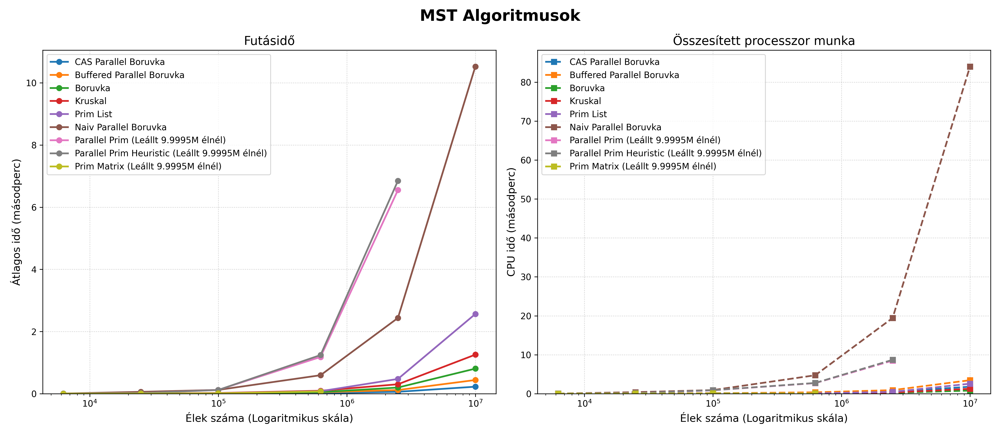
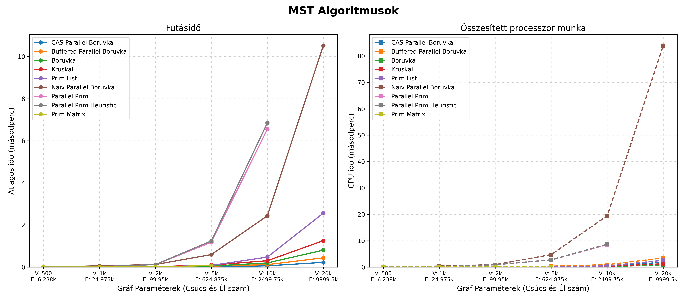
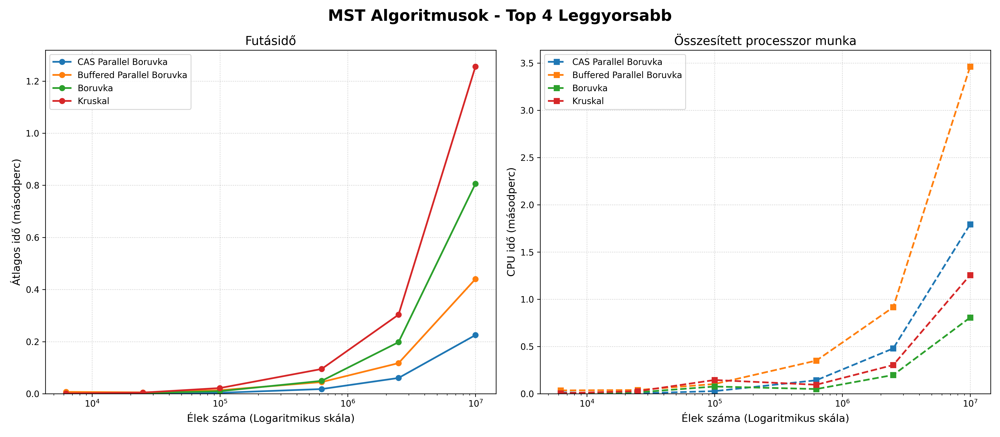

### **Sűrű gráfok** (Összes lehetséges él 80%-a)
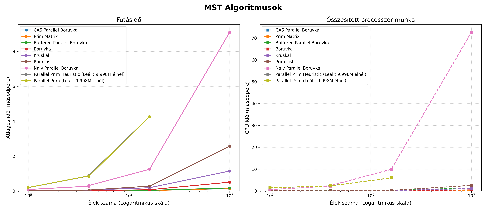
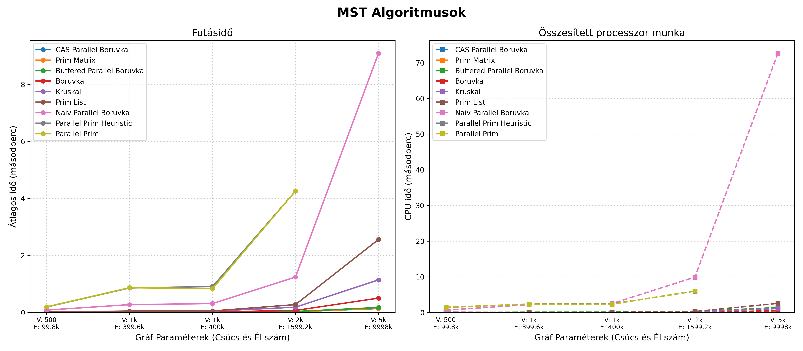
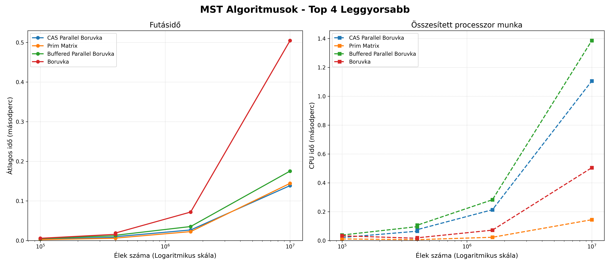
### Következtetések

- A **Parallel Prim** algoritmusok hatékonysága a vártnál jelentősen rosszabb.
    - Ennek okozója lehet az implementáció nem megfelelő optimalizáltsága is.
    - A forrás arra enged következtetni, hogy ennél jelentősen jobb hatékonyságot el lehet érni.
    - Magas párhuzamosítási overhead: A szekvenciális algoritmusok (mint a Kruskal vagy a Prim List) annyira gyorsak és memóriabarátok ritka gráfokon (gyakran a tizedmásodperc töredéke alatt lefutnak), hogy a párhuzamosítás "adminisztrációs" költsége (a szálak indítása, a mutexek lefoglalása és elengedése) egyszerűen felemészti, sőt meghaladja a hasznos számítási időt (Amdahl törvényének hatása).
        
- A **Borůvka algoritmus** különböző implementációi a vártnak megfelelő teljesítményt értek el, a CAS változat bizonyult a leghatékonyabbnak.
    - A mérések egyértelműen bizonyítják a zárolásmentes (Lock-Free) párhuzamosítás fölényét. A CAS Borůvka azért tud sűrű és ritka gráfokon is jobban teljesíteni minden másik algoritmusnál, mert a hardveres "Compare-And-Swap" atomi utasításokat használja a legkisebb élek frissítésére. Itt egyáltalán nincsenek mutexek, így nincsenek várakozó szálak és holtpontok sem; a modern többmagos processzorok teljes kapacitásukat a keresésre tudják fordítani.
        
- **Adatszerkezet és gráfsűrűség összefüggése:** A mérésekből tisztán látszik az elmélet gyakorlati igazolása: sűrű gráfok esetén a `Prim Matrix` algoritmus rendkívül gyors (hiszen egy mátrixban/tömbben $O(1)$ idő az élek vizsgálata), míg ritka gráfoknál ugyanez az algoritmus a felesleges nullák vizsgálata miatt veszít a hatékonyságából, és a `Prim List` veszi át a vezetést.

# Konklúzió és további kutatási irányok
## Konklúzió és gyakorlati tapasztalatok

A vizsgált algoritmusok (rendezések, adattömörítés és gráfbejárások) párhuzamosítása és a mérési eredmények kiértékelése egyértelműen rávilágított arra, hogy a hatékony többmagos végrehajtás nem csupán a szálak számának növelését jelenti. A modern processzorokon a nyers számítási teljesítmény gyakran másodlagos a memóriakezelés és a szinkronizáció mögött.
A kutatás során az alábbi kulcsfontosságú gyakorlati elvek (best practices) fogalmazódtak meg:

- **Zárolásmentes (Lock-Free) architektúrák preferálása:** A mérések legfőbb tanulsága, hogy a finomszemcsés zárolás (fine-grained locking, pl. `std::mutex`) kritikus szűk keresztmetszetet okoz. A szálak egymásra várása és az operációs rendszer szintű kontextusváltások felemésztik a párhuzamosításból nyert időt (ahogy az a Parallel Prim esetében is látható volt sűrű gráfoknál). A jövő a hardveres atomi utasításokra épülő, zárolásmentes algoritmusoké (mint a _CAS Borůvka_), amelyek drasztikusan jobban skálázódnak.
    
- **Szál-lokális memóriakezelés (Thread-Local Storage):** A globális változók és közös adatszerkezetek (pl. egy közös `cheapest` tömb a naiv Borůvkában) folyamatos írása a _Cache Line Bouncing_ (gyorsítótár-koherencia) jelensége miatt brutálisan lassítja a futást. A legjobb gyakorlat, ha minden szál saját, lokális pufferben (vagy thread-local változókban) dolgozik, és az eredményeket csak a feldolgozás legvégén fésülik össze (redukció).
    
- **Küszöbértékek és soros visszaváltás (Fallback/Thresholding):** A párhuzamosításnak magas az "adminisztrációs" költsége (overhead). A rekurzív algoritmusoknál (mint a _Párhuzamos Merge Sort_ vagy kis gráfkomponensek összevonása) elengedhetetlen egy mélységi korlát vagy küszöbérték bevezetése. Ha a probléma mérete egy bizonyos szint alá csökken, a feladatot kiosztás helyett át kell adni a rendkívül gyors szekvenciális (soros) végrehajtásnak.
    
- **Adatvezérelt algoritmus-választás (Ismerd a bemenetet!):** Nincs egyetlen "tökéletes" megoldás. A gráfalgoritmusok mérései tökéletesen igazolták, hogy a bemenet strukturális sajátosságai determinálják a módszert. Ami ritka gráfokon (Sparse) győztes stratégia (pl. prioritási sorokra épülő _Prim List_), az sűrű gráfokon (Dense) a felesleges adatszerkezeti komplexitás miatt elbukik az egyszerű, memóriafolytonos _Prim Matrix_-szal szemben.
    
- **Gyenge írásvédelem (Weak Write Protection) alkalmazhatósága:** Bizonyos keresési problémáknál (mint az MST legolcsóbb élének megtalálása), ahol a feltétel abszolút és idempotens, nem szükséges szigorúan védeni az adatkonzisztenciát minden olvasáskor. A CAS utasítások és az útvonal-felezéses DSU bebizonyították, hogy a megengedőbb memóriamodellek (pl. `memory_order_relaxed`) hatalmas sebességnövekedést hoznak adatvesztés vagy logikai hiba nélkül.
## Jövőbeli kutatási és fejlesztési irányok

A jelenlegi vizsgálatok és mérések egy stabil alapot biztosítanak a minimális feszítőfa (MST) algoritmusok párhuzamosításának megértéséhez, azonban a téma számos további izgalmas kutatási lehetőséget rejt magában.
A jövőbeli munkák során az alábbi irányokba érdemes kiterjeszteni a vizsgálatokat:

-  **A küszöbérték paraméterek precíz viszgálata:** A jelenlegi mérés keretei között a küszöbértékeket rövid tesztelés után véglegesítettem, így ennek a pararméternek a vizsgálata még további kutatási feladat. Érdekes téma lehet egy olyan párhuzamosítási keretrendszer megtervezése, ami a küszöbértékeket a hardware-hez igazítja az algoritmusokban, rövid előtesztelés és a valós futtatás alapján.

- **A szálak számának (skálázhatóság) hatása:** A jelenlegi mérések fix szálkészlettel történtek. Érdemes lenne részletesen vizsgálni és vizualizálni, hogyan változik a futásidő és a CPU-kihasználtság a szálak számának (1, 2, 4, 8, 16, 32 stb.) dinamikus növelésével. Ezzel pontosan meghatározható lenne az a hardveres "plafon", ahol a szálak közötti szinkronizációs költségek (overhead) és a memóriabusz telítődése miatt a további magok bevonása már nem hoz gyorsulást, esetleg teljesítményromlást okoz (Amdahl-törvényének gyakorlati megnyilvánulása).
    
- **Hardveres gyorsítás (GPU programozás):** Az OpenMP alapú, CPU-ra fókuszáló párhuzamosítás mellett a következő logikus lépés a grafikus kártyák (GPU) masszív számítási kapacitásának kiaknázása CUDA vagy OpenCL segítségével. Különösen az él- és komponens-alapú Borůvka-algoritmus alkalmas arra, hogy több ezer GPU magon fusson egyidejűleg. Ennek fő kutatási kihívása a memória-átvitelek (Host-to-Device) minimalizálása és a warp-divergencia (a szálak eltérő elágazásainak) elkerülése lenne.
    
- **Nagyobb komplexitású (exponenciális) problémák párhuzamosítása:** Az MST egy polinomiális időben (O(ElogV)) hatékonyan megoldható probléma. Mivel a soros algoritmusok önmagukban is rendkívül gyorsak, a párhuzamosítás adminisztrációs költsége arányaiban nagyon magas, olykor a hasznos munka rovására megy. Egy fontos kutatási irány lehetne a párhuzamosítási technikák (pl. Lock-Free adatszerkezetek) alkalmazása NP-nehéz, exponenciális komplexitású gráfproblémákon (például az Utazó ügynök probléma, vagy a Maximális klikk keresése). Ezeknél a számításigényes feladatoknál a párhuzamos keresés nagyságrendekkel nagyobb relatív és abszolút hasznot (gyorsulást) hozhat, mivel a szinkronizációs overhead eltörpül a megspórolt számítási idő mellett.

# Irodalomjegyzék

[1] GeeksforGeeks - Spanning Tree: [https://www.geeksforgeeks.org/dsa/spanning-tree/](https://www.geeksforgeeks.org/dsa/spanning-tree/) 
[2] GeeksforGeeks - Kruskal's MST: [https://www.geeksforgeeks.org/dsa/kruskals-minimum-spanning-tree-algorithm-greedy-algo-2/](https://www.geeksforgeeks.org/dsa/kruskals-minimum-spanning-tree-algorithm-greedy-algo-2/) 
[3] Xiwen Chen - Parallel Minimum Spanning Tree Algorithm: [https://wiki.eecs.yorku.ca/course_archive/2010-11/W/6490A/_media/public:xiwen.pdf](https://wiki.eecs.yorku.ca/course_archive/2010-11/W/6490A/_media/public:xiwen.pdf) 
[4] GeeksforGeeks - Pairing heap: https://www.geeksforgeeks.org/dsa/pairing-heap/ 
[5] Alan Gibbons, Wojciech Rytter - _Efficient parallel algorithms_

